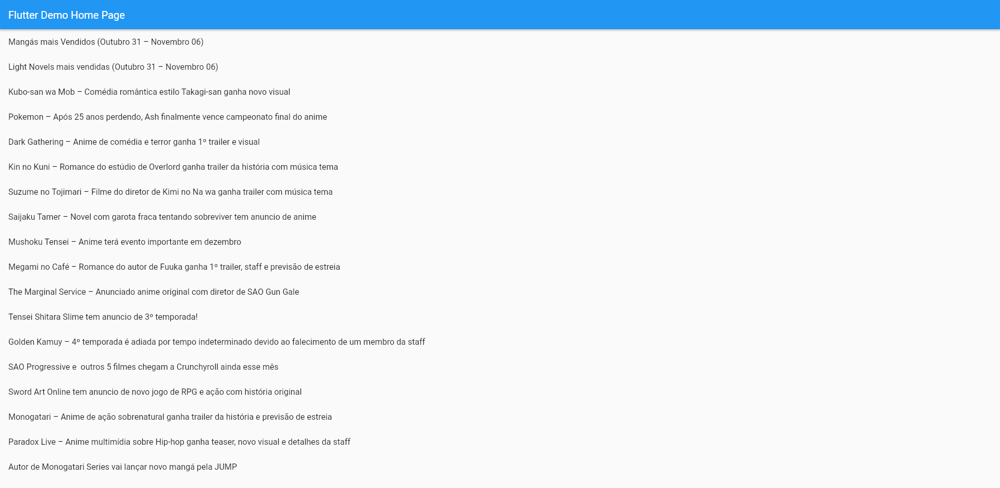

<h1 align="center"> Primeiro App Flutter </h1>

Aplicativo desenvolvido no Bootcamp de Flutter: Desenvolvendo meu primeiro APP do zero, promovido pelo UNIESP Centro Universitário e ministrado por Adby Santos e Allan Ramos.

  <a href="#-tecnologias">Tecnologias</a>&nbsp;&nbsp;&nbsp;|&nbsp;&nbsp;&nbsp;
  <a href="#-projeto">Projeto</a>&nbsp;&nbsp;&nbsp;|&nbsp;&nbsp;&nbsp;
  <a href="#-layout">Layout</a>&nbsp;&nbsp;&nbsp;|&nbsp;&nbsp;&nbsp;
  <a href="#memo-licença">Licença</a>

 

  

## 🚀 Tecnologias

Esse projeto foi desenvolvido com as seguintes tecnologias:

- [Dart](https://dart.dev/)
- [Flutter](https://flutter.dev/)

## 💻 Projeto

O projeto é um app básico criado com Flutter, explorando o desacoplamento dos componentes para que seja possível fazer alterações futuras no projeto em áreas pontuais, sem que haja comprometimento de toda sua estrutura. Neste APP há o consumo de uma API Rest com o intuito de exibir uma lista de Animes e sua descrição.

## 🔖 Layout

Você pode navegar pelo projeto através [DESSE LINK](https://primeiro-app-flutter.vercel.app/#/).

## :memo: Licença

Esse projeto está sob a licença MIT.

---

Desenvolvido por [Thiago Honorato](https://www.linkedin.com/in/honoratothiago/)
